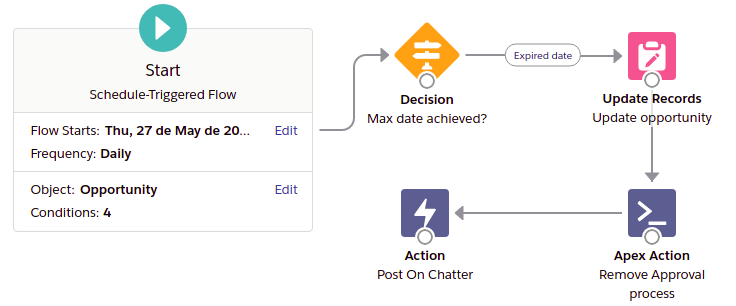

# Removendo processos de aprovações atráves de fluxos agendados



Configurando um fluxo agendado capaz excluir processos de aprovações pendentes.

## Instalando em uma Scratch Org

1. clone o repositório do git:
```
git clone https://github.com/PenseCloud/RemovendoProcessoAprovacaoComFluxos.git
```

2. Autorize seu DevHub ( caso queira, substitua o **myhuborg** por um alias a seu critério )
```
sfdx auth:web:login -d -a myhuborg
```

3. Crie uma nova Scratch Org para poder trabalhar ( caso queira, substitua o **approvalProcess** por um alias a seu critério )
```
sfdx force:org:create -s -f config/project-scratch-def.json -a approvalProcess
```

4. Faça o deploy dos metadados para a sua Scratch Org
```
sfdx force:source:push
```

5. Atribua o conjunto de permissões ao seu usuário:
```
sfdx force:user:permset:assign -n RemoveApprovalProcessWithFlow
```

6. Implante os dados de amostra
```
sfdx force:data:tree:import -p ./export/export_data-Account-Opportunity-plan.json
```

7. Abra sua scratch org
```
sfdx force:org:open
```

### Testando o fluxo
Inicialmente o fluxo está agendo para rodar todos os dias às 07:30 AM.
Você pode fazer uma depuração para verificar o comportamento e esperar até a próxima execução, ou pode ir até o fluxo chamado **Close lost opportunity** e alterar o horário de início para o que melhor se adapte a sua necessidade. Após alterá-lo você deverá salvar uma nova versão e ativá-lo para que possa executar com o novo horário.